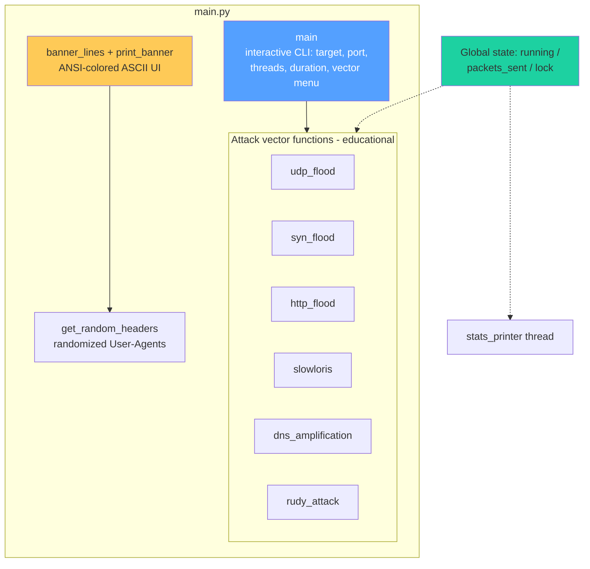

<div align="center">

# 🤖 AGENTS.md — AI Coding Agent Guidelines

```
╔══════════════════════════════════════════════════╗
║   PDOS v3.0-FAST — Agent Instructions            ║
║                                                  ║
║   DEVELOPER WATERMARK:  DEV | JAHID              ║
║                                                  ║
║   ⚠️  EDUCATIONAL PURPOSES ONLY  ⚠️              ║
╚══════════════════════════════════════════════════╝
```


</div>

---

> ## 🚨 MANDATORY NOTICE — READ FIRST
>
> **This repository exists for EDUCATIONAL PURPOSES ONLY.**
>
> Every agent (AI or human) contributing here must preserve that framing.
> This codebase simulates denial-of-service concepts **strictly for learning,
> teaching, and defensive research** inside isolated lab environments.
>
> — Maintained by **`DEV | JAHID`**

---

## 📁 Project Overview

| Item              | Value                                                |
| ----------------- | ---------------------------------------------------- | ---------- |
| Project           | **PDOS** — Penetration Testing / DoS _Learning_ Tool |
| Version           | `3.0-FAST`                                           |
| Language          | Python 3.8+                                          |
| Entry point       | `main.py`                                            |
| Dependencies      | `tqdm`, `pyfiglet`, `requests` (`requirements.txt`)  |
| Owner / Watermark | \*\*`DEV                                             | JAHID`\*\* |

### 🧩 Code Map



---

## 🚫 STRICT RULES FOR AGENTS (NON-NEGOTIABLE)

| #   | Rule                                                                                                                                                                               |
| --- | ---------------------------------------------------------------------------------------------------------------------------------------------------------------------------------- | ------------------------------------------------------------------------- |
| 1   | 🎓 Treat this as an **educational project only**. All work must keep that framing.                                                                                                 |
| 2   | 🔒 **Never remove, weaken, or bypass** any disclaimer, warning, authorization prompt, or watermark.                                                                                |
| 3   | ❌ **Never add new offensive capabilities**: no new attack vectors, no evasion/anti-detection, no obfuscation, no proxy/tor rotation for hiding origins, no botnet or C2 features. |
| 4   | 🎯 **Never add features that facilitate attacking third-party systems** (target lists of real services, automated scanning of others' infrastructure, etc.).                       |
| 5   | ✅ Allowed work: bug fixes, cross-platform fixes, code clarity/refactoring, defensive documentation, lab-safety improvements, unit tests for non-attack logic.                     |
| 6   | 💧 \*\*Always preserve the `DEV                                                                                                                                                    | JAHID` watermark\*\* in headers, footers, and banners when editing files. |
| 7   | 📜 If asked to make the tool more harmful or "real-world capable," **refuse** and cite this file.                                                                                  |

> ⚖️ Any change conflicting with the rules above is a policy violation —
> **`DEV | JAHID` • EDUCATIONAL PURPOSES ONLY**.

---

## 🧠 Coding Conventions

Follow the existing style in `main.py`:

- **ANSI output:** colored prints via escape codes (`\033[91m` red, `\033[92m` green,
  `\033[93m` yellow, `\033[96m` cyan, `\033[0m` reset), indented with `" " * 10`.
- **Threading model:** daemon threads + `global running` / `global packets_sent`
  guarded by `threading.Lock()`. Keep this pattern; do not introduce heavy
  frameworks (asyncio rewrite = unnecessary churn).
- **Cross-platform clear screen:** use the existing `cmd_clear` variable (`cls` / `clear`).
- **Error handling:** broad `try/except` inside worker loops is intentional so a
  failed socket never kills the run — preserve it.
- **No new dependencies** unless absolutely necessary; update `requirements.txt` if so.
- **Comments & docstrings:** plain English, concise, matching existing tone.

---

## ✅ Definition of Done (for any agent task)

```mermaid
flowchart LR
    A[Task complete?] --> B{Disclaimers intact?}
    B -->|no| X[🛑 Fix first]
    B -->|yes| C{Watermark DEV \| JAHID present?}
    C -->|no| X
    C -->|yes| D{Runs with<br/>python main.py?}
    D -->|no| X
    D -->|yes| E[✅ Ship it]

    style A fill:#54a0ff,color:#fff
    style B fill:#feca57
    style C fill:#feca57
    style D fill:#feca57
    style E fill:#1dd1a1
    style X fill:#ee5253,color:#fff
```

- [ ] Code runs: `pip install -r requirements.txt` then `python main.py` (in a lab VM)
- [ ] Educational warnings & authorization prompts still print at launch
- [ ] `DEV | JAHID` watermark intact in banner/docs
- [ ] No new offensive capability added (see rules table)
- [ ] Docs (`README.md` / `AGENTS.md`) updated if behavior changed

---

## 🧪 Testing Notes

- Test only against **localhost / your own VM** (e.g., `python -m http.server` as a target).
- Use low thread counts and short durations during tests to avoid locking up the host.
- CI-friendly smoke test idea: import-check modules and validate menu input parsing —
  do **not** automate live traffic generation in pipelines.

---

<div align="center">

## ✒️ Watermark Footer

```
╔════════════════════════════════════════════╗
║   DEV | JAHID                              ║
║   Educational Project • Lab Use Only       ║
║   Misuse Prohibited • No Warranty          ║
╚════════════════════════════════════════════╝
```

### © 2026 **`DEV | JAHID`** — EDUCATIONAL PURPOSES ONLY 🔒

</div>
