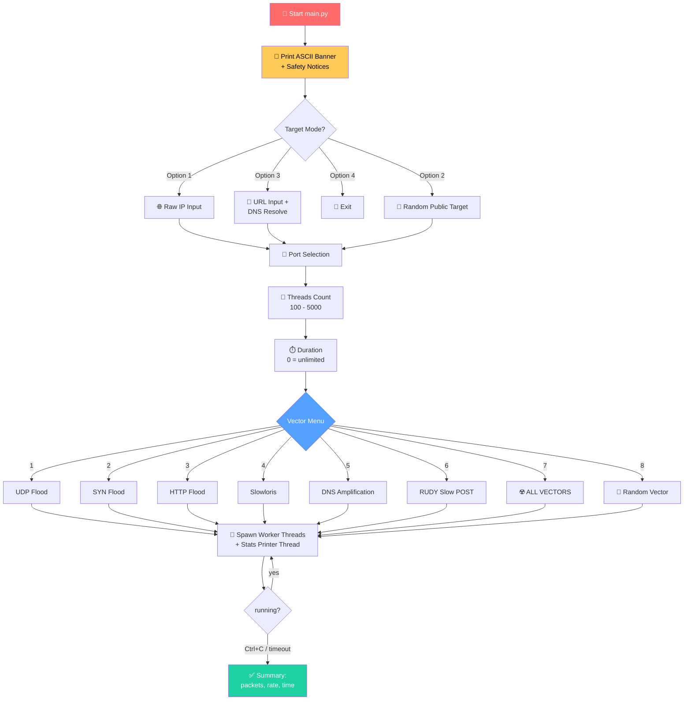
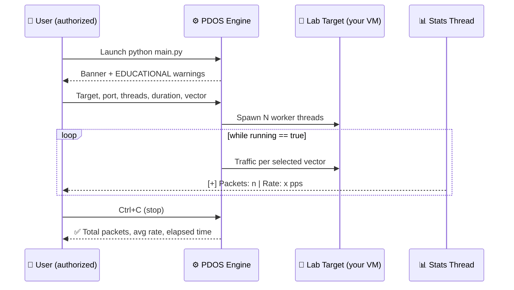
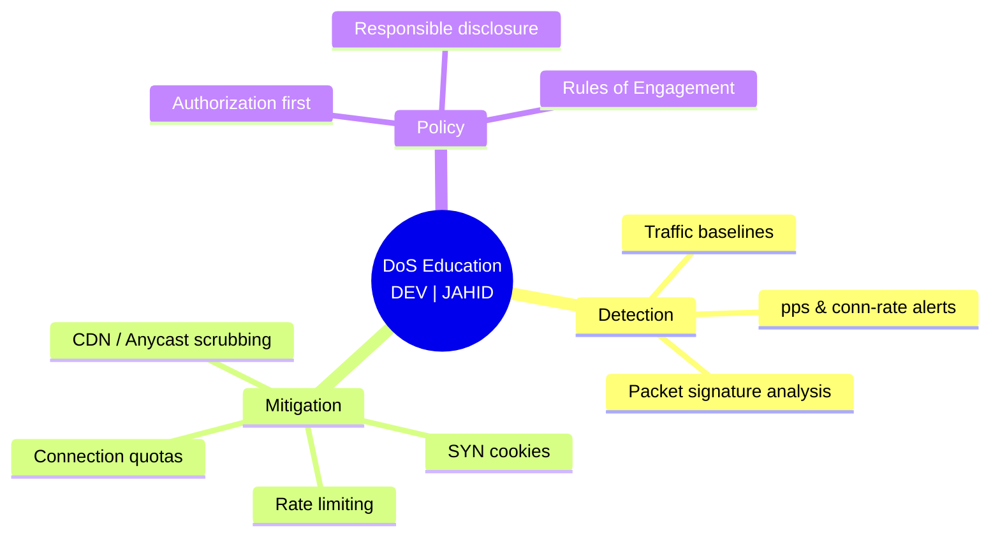

<div align="center">

# ⚡ P.D.O.S — Penetration & Denial-of-Service Simulator ⚡

```
 ██████╗ ██████╗  ██████╗ ███████╗
 ██╔══██╗██╔══██╗██╔═══██╗██╔════╝
 ██████╔╝██║  ██║██║   ██║███████╗
 ██╔═══╝ ██║  ██║██║   ██║╚════██║
 ██║     ██████╔╝╚██████╔╝███████║
 ╚═╝     ╚═════╝  ╚═════╝ ╚══════╝
```


## 🏷️ DEVELOPER WATERMARK

# `DEV | JAHID`

---

> ## ⚠️⚠️⚠️ EDUCATIONAL PURPOSES ONLY ⚠️⚠️⚠️
>
> **THIS PROJECT IS FOR EDUCATIONAL AND RESEARCH PURPOSES ONLY.**
>
> - 🎓 Built purely to **learn** how network stress-testing and DoS concepts work.
> - 🔬 Use it **only** against systems you **OWN** or have **WRITTEN AUTHORIZATION** to test.
> - 🚫 Launching attacks against systems without permission is **ILLEGAL** worldwide
>   (CFAA, Computer Misuse Act, IT Act, GDPR-adjacent laws, etc.).
> - 👨‍⚖️ The developer **`DEV | JAHID`** takes **NO responsibility** for any misuse or damage.
> - 💼 Real engagements require a signed **Rules of Engagement / penetration-testing contract**.

</div>

---

<div align="center">

## 🗺️ Table of Contents

| #   | Section                                        | #   | Section                                                               |
| --- | ---------------------------------------------- | --- | --------------------------------------------------------------------- |
| 1   | [Features](#-features)                         | 5   | [Attack Vectors (Educational)](#-attack-vectors-educational-overview) |
| 2   | [Architecture Diagram](#-architecture-diagram) | 6   | [Defensive Lessons](#-defensive-lessons-why-this-matters)             |
| 3   | [Installation](#-installation)                 | 7   | [Legal & Ethics](#%EF%B8%8F-legal--ethics--disclaimer)                |
| 4   | [Usage](#-usage-guide)                         | —   |                                                                       |

**`DEV | JAHID` • EDUCATIONAL PURPOSES ONLY**

</div>

---

## ✨ Features

| Feature                      | Description                                               |
| ---------------------------- | --------------------------------------------------------- |
| 🧵 **Multi-threaded engine** | Configurable thread count (1–5000+) for stress simulation |
| 🎯 **IP or URL targeting**   | Auto DNS resolution of hostnames                          |
| 🔀 **8 attack modes**        | 6 vectors + Nuclear (all) + Random selection              |
| 📊 **Live statistics**       | Real-time packets/sec counter with elapsed timer          |
| ⏱️ **Duration control**      | Run for N seconds or unlimited until `Ctrl+C`             |
| 🌈 **Colorful CLI**          | ANSI-colored banner, menus, and status output             |
| 🛡️ **Safety notices**        | Authorization prompts printed at every launch             |

> 🔖 _Authored & maintained by_ **`DEV | JAHID`** — _for learning environments only._

---

## 🏗️ Architecture Diagram



---

## 🌐 Network Layer Attack Surface

```mermaid
flowchart LR
    subgraph L7[🖥️ Layer 7 — Application]
        HTTPF[HTTP Flood]
        SLOWL[Slowloris]
        RUDY[RUDY / Slow POST]
    end
    subgraph L4[🔗 Layer 4 — Transport]
        SYNF[SYN Flood]
        UDPF[UDP Flood]
    end
    subgraph L3[📦 Layer 3 — Network]
        DNSA[DNS Amplification]
    end

    ATTACKER([😈 Stress Simulator<br/><b>DEV \| JAHID — LAB ONLY</b>]) --> L7
    ATTACKER --> L4
    ATTACKER --> L3

    style L7 fill:#ee5253,color:#fff
    style L4 fill:#f39c12,color:#fff
    style L3 fill:#00b894,color:#fff
    style ATTACKER fill:#2d3436,color:#fff
```

---

## ⚙️ Installation

```bash
# 1️⃣ Clone / copy the project folder
cd ddos

# 2️⃣ Install dependencies (educational lab environment)
pip install -r requirements.txt

# 3️⃣ Run inside your OWN isolated test lab
python main.py
```

<details>
<summary>📦 <b>requirements.txt</b> (click to expand)</summary>

```text
tqdm
pyfiglet
requests
```

</details>

> 🧪 **Recommended safe practice targets:** your own virtual machine, a local
> Docker container, or a dedicated home-lab server. **Never** a public service.
> — `DEV | JAHID`

---

## 📖 Usage Guide

| Step | Prompt                                      | Example      |
| ---- | ------------------------------------------- | ------------ |
| 1    | Target mode (`1` IP / `2` random / `3` URL) | `1`          |
| 2    | Target address                              | `127.0.0.1`  |
| 3    | Custom port? `[y/n]`                        | `y` → `8080` |
| 4    | Threads (100–5000)                          | `500`        |
| 5    | Duration in seconds (`0` = unlimited)       | `30`         |
| 6    | Attack vector (`1`–`8`)                     | `2`          |
| 7    | Stop the run                                | `Ctrl+C`     |

### 🎬 Session Lifecycle



> 🔖 _Documentation by_ **`DEV | JAHID`** — _educational use only._

---

## 🎓 Attack Vectors (Educational Overview)

> These summaries explain the **concept** behind each vector so students and
> defenders can recognize them. Descriptions are high-level on purpose.
> **— `DEV | JAHID`, EDUCATIONAL PURPOSES ONLY**

| #   | Vector                | Layer | Concept (simplified)                                       | Classic Defense                         |
| --- | --------------------- | ----- | ---------------------------------------------------------- | --------------------------------------- |
| 1   | **UDP Flood**         | L4    | Saturates bandwidth with junk UDP datagrams                | Rate-limiting, egress/ingress filtering |
| 2   | **SYN Flood**         | L4    | Half-open TCP connections exhaust the backlog queue        | SYN cookies, backlog tuning             |
| 3   | **HTTP Flood**        | L7    | High-volume GET/POST requests drain app resources          | WAF, caching, bot detection             |
| 4   | **Slowloris**         | L7    | Keeps many connections half-open with partial headers      | Request timeouts, connection limits     |
| 5   | **DNS Amplification** | L3    | Small queries → large responses reflected at a victim      | BCP-38 anti-spoofing, DNS rate-limits   |
| 6   | **RUDY (Slow POST)**  | L7    | Sends POST bodies extremely slowly, pinning server threads | Body-size/time limits, IDS rules        |
| 7   | **☢️ Nuclear**        | All   | All vectors combined (lab demonstration only)              | Full DDoS protection stack              |
| 8   | **🎲 Random**         | Mixed | Randomly picks one vector per run                          | Behavioral anomaly detection            |

---

## 🛡️ Defensive Lessons — Why This Matters

Understanding attack mechanics is how blue teams get better. Studying this tool teaches:

- 🔎 How to **identify traffic signatures** of each DoS class in packet captures
- 🧱 Why **rate limiting**, **SYN cookies**, and **connection quotas** exist
- ⚖️ How **CDNs / reverse proxies / WAFs** absorb application-layer floods
- 📈 How to build **monitoring dashboards** that alert on pps/connection anomalies
- 🧪 How to safely **load-test your own infrastructure** before real-world launch



---

## ⚠️ Legal & Ethics — Disclaimer

<div align="center">

> ### 🚨 READ BEFORE RUNNING — EDUCATIONAL PURPOSES ONLY 🚨
>
> | Rule                           | Detail                                                          |
> | ------------------------------ | --------------------------------------------------------------- |
> | 🎯 **Authorized targets ONLY** | Your own lab, VM, or systems with written permission            |
> | ❌ **No public targets**       | Attacking third-party systems is a **criminal offense**         |
> | 🏫 **Classroom use**           | Use in isolated networks under instructor supervision           |
> | 👮 **No evasion features**     | This tool intentionally contains none — and must never gain any |
> | 📜 **No warranty**             | Provided _as-is_, without warranty of any kind                  |

</div>

By using this repository you confirm you understand that **denial-of-service
attacks against systems you do not own or are not authorized to test are
illegal** under laws such as the U.S. CFAA, the U.K. Computer Misuse Act,
the E.U./E.E.A. national penal codes, India's IT Act §43/§66, and similar
legislation worldwide.

---

<div align="center">

## ✒️ Watermark & Credits

```
╔════════════════════════════════════════════╗
║                                            ║
║        DEV | JAHID                         ║
║   Educational Project • Not for misuse     ║
║                                            ║
║   PDOS v3.0-FAST — Learning Edition        ║
║                                            ║
╚════════════════════════════════════════════╝
```


### © 2026 **`DEV | JAHID`** — All rights reserved • For education only 🔒

</div>
